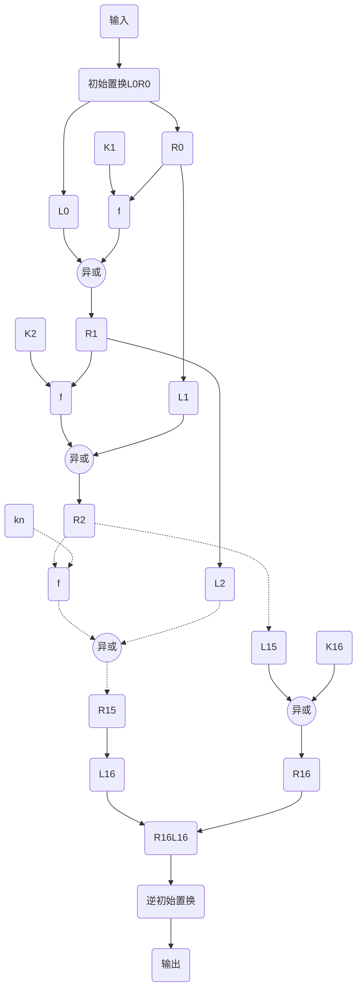

# DES加密算法

<span id='toc'></span>
[TOC]

## [简要说明](#toc)

- 对称加密算法;
- 加密块大小: 64位;
- 密钥长度: 64位(加密算法只用了其中的56位, 另8位可作为校验位使用);
- 输出密文长度: 64位;
- 加密迭代次数: 16轮;

## [算法流程](#toc)



## [算法步骤](#toc)

- 相关矩阵常量见附录;

### [Key Schedule计算](#toc)

记有64位长密钥$KEY$, 置换$PC1_C$/$PC1_D$/$PC2$, 及每一轮迭代的循环左移函数$LS$. 通过$PC1_C$和$PC1_D$置换选择得到28位长的$C_0$和$D_0$, 那么第$i$轮的加密密钥$K_i$计算步骤如下($i=[0, 16)$):  

- $C_{i+1} = C_i \lll LS[i]$, $D_{i+1} = D_i \lll LS[i]$;
- $K' = C_{i+1} \ll 28 \quad |  \quad D_{i+1}$;
- $PC2: K' \rightarrow K_{i+1}$

### [加密](#toc)

记有64位输入输入$Input$, 初始置换$IP$和其逆$IP^{-1}$, feistel函数$f$, 每一轮迭代的加密密钥集$K$. 通过初始置换$IP$映射得到$LR$, $LR = L_0 \ll 32 \quad | \quad R_0$. 那么第$i$轮加密过程可描述如下($i=[0,15]$):  

- $L_{i+1} = R_{i}$;
- $R_{i+1} = L_{i} \oplus f(R_{i}, K_{i+1})$;

通过以上迭代16轮后, 得到$L_{16}$和$R_{16}$, 组合得到预输出$RL = R_{16} \ll 32 \quad | \quad L_{16}$, 再通过$IP^{-1}$置换得到输出数据$Output$.

#### [Feistel函数](#toc)

记有从32位扩展到48位映射矩阵$E$和压缩映射矩阵$S_i$, 及置换$P$. 对于32位的输入$R$和48位长的密钥$K$, $f$计算过程如下:  

- $E: R \rightarrow R'$;  
- $t = K \oplus R'$;
- 将$t$按每6位一组, 共8组, 每组记为$t_i$($i=[0,7]$). 将$t_i$的第0位和第5位组合在一起的十进制数记为$m$, 将$t_i$中间的4位组合在一起记为$n$. 例$t_i=011011$, 那么$m=01=2$, $n=1101=13$;
- $S: t_i \rightarrow t_{i}^{'}$, 映射方式是$t_{i}^{'}=S[m*16+n]$, $t_{i}^{'}$是4位的;
- 将$t_{0}^{'} \cdots t_{7}^{'}$拼接组合在一起得到$t_{0}^{'}t_{1}^{'}\dots t_{7}^{'}$得到32位长的数据, 记为$d$;
- $P: d \rightarrow d'$置换得到f的输出;

### [解密](#toc)

解密是加密的逆过程, 步骤略;

## [附录](#toc)

## [符号说明](#toc)

- 字节序: 大端序;
- $\lll$: 循环左移;
- $\ll$: 逻辑左移;
- $\oplus$: 二进制加模2;
- $p: S' \rightarrow S$: 通过映射(置换)$p$, 从集$S'$映射到$S$. 本文中, 如无特别说明, 就是将$S'$的第$p[i]$位放在$S$的第$i$位;

### [TDEA](#toc)

TDEA三重DES加密: 通过三组密钥$[K1, K2, K3]$重复三次加密解密. 即加密过程: 用密钥$K1$DES加密, $K2$DES解密, $K3$DES加密; 解密是其逆过程; 描述如下:  

$$
\begin{aligned}
Input \rightarrow DES(E_{K1}) \rightarrow DES(D_{K2}) \rightarrow DES(E_{K3}) \rightarrow Output \\
\quad
Input \rightarrow DES(D_{K3}) \rightarrow DES(E_{K2}) \rightarrow DES(D_{K1}) \rightarrow Output
\end{aligned}
$$

标准中$[K1, K2, K3]$有如下三种可能:  

- $K1 \neq K2 \neq K3$;
- $K1 \neq K2, K3 = K1$;
- $K1 = K2 = K3$;

## [常量表](#toc)

```Rust
/// 初始置换IP  
const DES_IP: [u8; 64] = [
58, 50, 42, 34, 26, 18, 10, 2,
60, 52, 44, 36, 28, 20, 12, 4,
62, 54, 46, 38, 30, 22, 14, 6,
64, 56, 48, 40, 32, 24, 16, 8,
57, 49, 41, 33, 25, 17, 9, 1,
59, 51, 43, 35, 27, 19, 11, 3,
61, 53, 45, 37, 29, 21, 13, 5,
63, 55, 47, 39, 31, 23, 15, 7,
];
```

```Rust
/// 逆初始置换IIP  
const DES_IIP: [u8; 64] = [
40, 8, 48, 16, 56, 24, 64, 32,
39, 7, 47, 15, 55, 23, 63, 31,
38, 6, 46, 14, 54, 22, 62, 30,
37, 5, 45, 13, 53, 21, 61, 29,
36, 4, 44, 12, 52, 20, 60, 28,
35, 3, 43, 11, 51, 19, 59, 27,
34, 2, 42, 10, 50, 18, 58, 26,
33, 1, 41, 9, 49, 17, 57, 25,
];
```

```Rust
/// feistel函数使用的相关映射表  
/// 32位长度数据映射到48位长数据的位映射表  
const DES_E: [u8; 48] = [
32, 1, 2, 3, 4, 5,
4, 5, 6, 7, 8, 9,
8, 9, 10, 11, 12, 13,
12, 13, 14, 15, 16, 17,
16, 17, 18, 19, 20, 21,
20, 21, 22, 23, 24, 25,
24, 25, 26, 27, 28, 29,
28, 29, 30, 31, 32, 1,
];

/// 48位长数据映射到32位长数据的映射表, Si将第i个6位数据映射到4位长数据  
const DES_S1: [u8; 64] = [
14, 4, 13, 1, 2, 15, 11, 8, 3, 10, 6, 12, 5, 9, 0, 7,
0, 15, 7, 4, 14, 2, 13, 1, 10, 6, 12, 11, 9, 5, 3, 8,
4, 1, 14, 8, 13, 6, 2, 11, 15, 12, 9, 7, 3, 10, 5, 0,
15, 12, 8, 2, 4, 9, 1, 7, 5, 11, 3, 14, 10, 0, 6, 13,
];

const DES_S2: [u8; 64] = [
15, 1, 8, 14, 6, 11, 3, 4, 9, 7, 2, 13, 12, 0, 5, 10,
3, 13, 4, 7, 15, 2, 8, 14, 12, 0, 1, 10, 6, 9, 11, 5,
0, 14, 7, 11, 10, 4, 13, 1, 5, 8, 12, 6, 9, 3, 2, 15,
13, 8, 10, 1, 3, 15, 4, 2, 11, 6, 7, 12, 0, 5, 14, 9,
];

const DES_S3: [u8; 64] = [
10, 0, 9, 14, 6, 3, 15, 5, 1, 13, 12, 7, 11, 4, 2, 8,
13, 7, 0, 9, 3, 4, 6, 10, 2, 8, 5, 14, 12, 11, 15, 1,
13, 6, 4, 9, 8, 15, 3, 0, 11, 1, 2, 12, 5, 10, 14, 7,
1, 10, 13, 0, 6, 9, 8, 7, 4, 15, 14, 3, 11, 5, 2, 12,
];

const DES_S4: [u8; 64] = [
7, 13, 14, 3, 0, 6, 9, 10, 1, 2, 8, 5, 11, 12, 4, 15,
13, 8, 11, 5, 6, 15, 0, 3, 4, 7, 2, 12, 1, 10, 14, 9,
10, 6, 9, 0, 12, 11, 7, 13, 15, 1, 3, 14, 5, 2, 8, 4,
3, 15, 0, 6, 10, 1, 13, 8, 9, 4, 5, 11, 12, 7, 2, 14,
];

const DES_S5: [u8; 64] = [
2, 12, 4, 1, 7, 10, 11, 6, 8, 5, 3, 15, 13, 0, 14, 9,
14, 11, 2, 12, 4, 7, 13, 1, 5, 0, 15, 10, 3, 9, 8, 6,
4, 2, 1, 11, 10, 13, 7, 8, 15, 9, 12, 5, 6, 3, 0, 14,
11, 8, 12, 7, 1, 14, 2, 13, 6, 15, 0, 9, 10, 4, 5, 3,
];

const DES_S6: [u8; 64] = [
12, 1, 10, 15, 9, 2, 6, 8, 0, 13, 3, 4, 14, 7, 5, 11,
10, 15, 4, 2, 7, 12, 9, 5, 6, 1, 13, 14, 0, 11, 3, 8,
9, 14, 15, 5, 2, 8, 12, 3, 7, 0, 4, 10, 1, 13, 11, 6,
4, 3, 2, 12, 9, 5, 15, 10, 11, 14, 1, 7, 6, 0, 8, 13,
];

const DES_S7: [u8; 64] = [
4, 11, 2, 14, 15, 0, 8, 13, 3, 12, 9, 7, 5, 10, 6, 1,
13, 0, 11, 7, 4, 9, 1, 10, 14, 3, 5, 12, 2, 15, 8, 6,
1, 4, 11, 13, 12, 3, 7, 14, 10, 15, 6, 8, 0, 5, 9, 2,
6, 11, 13, 8, 1, 4, 10, 7, 9, 5, 0, 15, 14, 2, 3, 12,
];

const DES_S8: [u8; 64] = [
13, 2, 8, 4, 6, 15, 11, 1, 10, 9, 3, 14, 5, 0, 12, 7,
1, 15, 13, 8, 10, 3, 7, 4, 12, 5, 6, 11, 0, 14, 9, 2,
7, 11, 4, 1, 9, 12, 14, 2, 0, 6, 10, 13, 15, 3, 5, 8,
2, 1, 14, 7, 4, 10, 8, 13, 15, 12, 9, 0, 3, 5, 6, 11,
];

/// feistel使用的置换函数  
const DES_P: [u8; 32] = [
16, 7, 20, 21,
29, 12, 28, 17,
1, 15, 23, 26,
5, 18, 31, 10,
2, 8, 24, 14,
32, 27, 3, 9,
19, 13, 30, 6,
22, 11, 4, 25,
];
```

```Rust
/// key schedule密钥调度表计算使用到的映射表  
const DES_PC1_C: [u8; 28] = [
57, 49, 41, 33, 25, 17, 9,
1, 58, 50, 42, 34, 26, 18,
10, 2, 59, 51, 43, 35, 27,
19, 11, 3, 60, 52, 44, 36,
];  

const DES_PC1_D: [u8; 28] = [
63, 55, 47, 39, 31, 23, 15,
7, 62, 54, 46, 38, 30, 22,
14, 6, 61, 53, 45, 37, 29,
21, 13, 5, 28, 20, 12, 4,
];  

const DES_PC2: [u8; 48] = [
14, 17, 11, 24, 1, 5,
3, 28, 15, 6, 21, 10,
23, 19, 12, 4, 26, 8,
16, 7, 27, 20, 13, 2,
41, 52, 31, 37, 47, 55,
30, 40, 51, 45, 33, 48,
44, 49, 39, 56, 34, 53,
46, 42, 50, 36, 29, 32,
];

/// 每轮密钥计算的左移位数  
const DES_LS: [u8; 16] = [
1, 1, 2, 2, 2, 2, 2, 2, 1, 2, 2, 2, 2, 2, 2, 1,
];
```

## [参考资料](#toc)

- FIPS 46-3;
