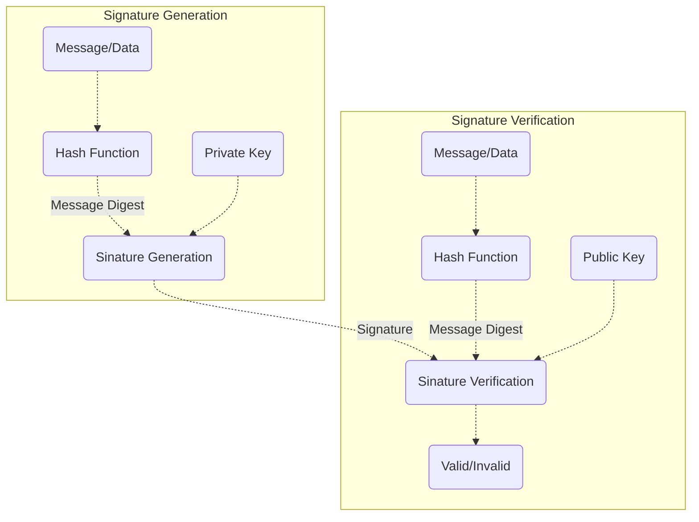
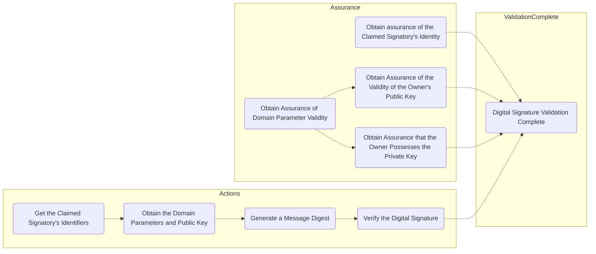

# DSS数字签名标准

[Rust实现](https://crates.io/crates/rcrypto);

[TOC]

## [DSA](#toc)

- 签名过程:

- 初始化设置:
  - Obtain Domain Parameter;
  - Obtain Assurance of Domain Parameter Validity;
  - Obtain DS Key Pair;
  - Obtain Assurance of Public Key Validity;
  - Obtain Assurance of Possession of the DS Private Key;
  - Register the Public Key and Identify with a TTP(Optional);

- 数字签名生成:
  - Generate a Message Digest;
  - Obtain Additional Information for the Digital Signature Process;
  - Generate a Digital Signature;
  - Verify the Digital Signature(Optional);

- 数字签名的验证和确认:

### [DSA参数](#toc)

- 公钥$y=g^x\mod p$;
- 私钥$x\in [1,q-1]$;
- 素数$p$, 位长度为$L$, $p\in (2^{L-1}, 2^L)$;
- 和$p-1$互质的素数$q$, 位长度记为$N$, $q\in (2^{N-1}, 2^N)$;
- 乘法群$GF(p)$中阶为$q$的子群的生成子$g$, $g \in (1,p)$;
- 伪随机整数$k$, $k\in [1,q-1]$;

#### [DSA域参数](#toc)

- $p, q, g$;
- 可选的`domain_parameter_seed/counter`, 用于$p,q$的生成;

### [DSA参数选择](#toc)

- 规范指定的(L,N)长度选择:
  - L = 1024, N = 160;
  - L = 2048, N = 224;
  - L = 2048, N = 256;
  - L = 3072, N = 256;
- 哈希函数的选择要满足其安全强度大于$min(L,N)$;

### [DSA签名生成](#toc)

- 记Hash函数的输出位字符串的位长度为$outlen$;
- 记`truncate_l(bit_str, len)`表示取位字符串`bit_str`的最左边的`len`位;
- $k^{-1}$表示关于随机数$k$的模$q$的逆, 即$(k^{-1}\cdot k)\mod q = 1$;
- 签名$(r,s)$的计算如下:

$$
\begin{aligned}
& r = (g^k \mod p) \mod q \\
& z = truncate_l(Hash(M), min(N, outlen)) \\
& s = (k^{-1}(z+x\cdot r))\mod q;
\end{aligned}
$$

### [DSA签名的验证和确认](#toc)

- 假设认证者已经确认了域参数和公钥;
- 记接受者收到了消息$M'$, 和签名$(r', s')$, 则签名验证如下;
  - 签名需满足$0\lt r' \lt q$, $0 \lt s' \lt q$;
  - $r'$需满足$r'=v$:
    - $w = (s')^{-1}\mod q$;
    - $z = truncate_l(Hash(M'), min(N, outlen))$;
    - $u1 = (z\cdot w)\mod q$;
    - $u2 = (r' \cdot w)\mod q$;
    - $v = ((g^{u1}\cdot y^{u2})\mod p) \mod q$;

## [RSA数字签名算法](#toc)

- 公钥$(n, e)$;
- 私钥$(n, d)$;

相关的标准有:

- ANS X9.31;
- [PKCS1](https://www.cnblogs.com/mengsuenyan/p/13796306.html);

## [ECDSA数字签名算法](#toc)

相关标准:

- [ANS X9.62](https://www.cnblogs.com/mengsuenyan/p/13816789.html);

其它内容**待补充**;

## [参考资料](#toc)

- FIPS 186-4;
- FIPS 186-5-draft;
