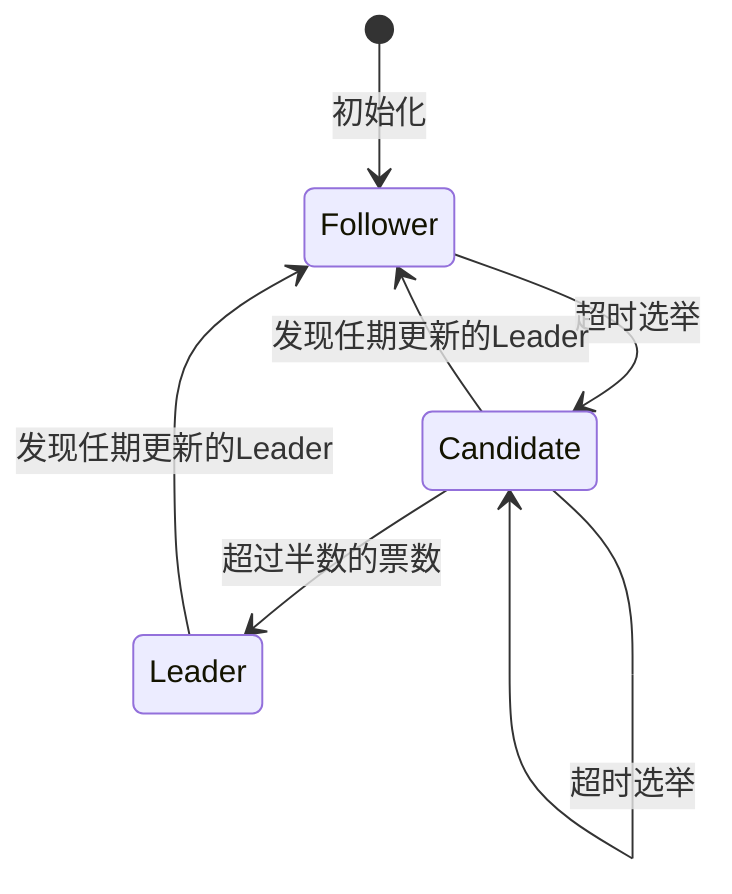
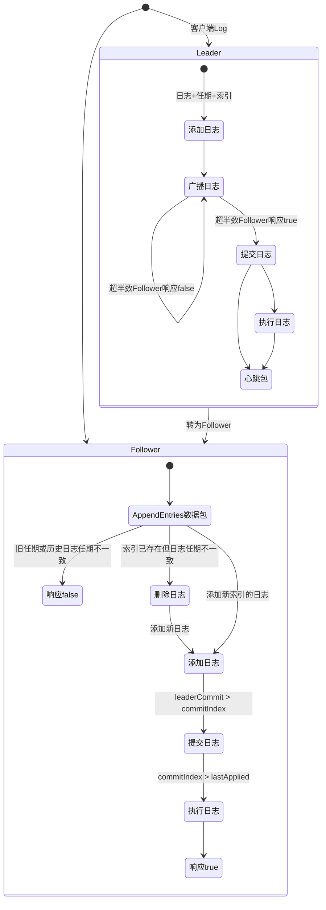

# Raft一致性算法

[TOC]

## [前要说明](#toc)

为了便于理解和实现, Raft算法将集群中多台服务器之间一致性问题分解为: Leader选举, 日志复制和安全这几个子问题;

记有集群$\{C_i,\ i=1,2\dots m\}$, 角色集$R=\{Leader, Candidate, Follower\}$, 客户端向集群发送的日志请求为集$\{L_j,\ j=1,2\dots n\}$. $\{C_i\}$中每台服务器(每个元素)$C_i$都有角色属性$r$, 满足$r\in R$. 称集群中至少有$m/2 +1$个元素都能完成相同的日志请求$L_j$的工作状态(一致性工作状态下)为*稳态*, 非一致性工作状态下为*非稳态*. 实现Raft算法的集群的工作状态总是能在有限的时间内从非稳态收敛到稳态;

### [集群中服务器状态](#toc)

$\forall C\in \{C_i\}$的持久化状态:
|状态|说明|
|:-:|:-:|
|`currentTerm`|$C$接收到的最新Leader/Candidate任期号(初始值是0, 单调递增)|
|`log[]`|有序日志条目集(**每条日志条目包含从客户端接收的日志, 及接收该日志的Leader的任期**), 索引从1开始|
|`votedFor`|当前任期, $C$接收到的投票请求的Candidate的ID标识|

$\forall C\in \{C_i\}$的易变状态:
|状态|说明|
|:-:|:-:|
|`commidIndex`|$C$接收到的集群中已提交的日志条目索引的最大值(初始值0, 单调递增)|
|`lastApplied`|$C$接收到的集群中已执行的日志条目索引的最大值(初始值0, 单调递增)|

$\forall C\in \{C_i\}, r=Leader$的易变状态:
|状态|说明|
|:-:|:-:|
|`nextIndex[]`|当前Leader向$C_i$发送的下一条日志条目的索引(初始为`log[]`最大索引+1)|
|`matchIndex[]`|当前Leader已经成功向$C_i$复制的最后一条日志条目的索引(初始为0, 单调递增)|

### [RequestVote RPC](#toc)

RequesetVote RPC只由$C_i, r=Candidate$的服务器用于请求投票调用;

- 远程调用需要提供的参数:
  - term: 该Candidate的`currentTerm`;
  - candidateId: 该Candidate的ID标识;
  - lastLogIndex: 该Candidate的日志条目`log[]`中最后一条日志的索引;
  - lastLogTerm: lastLogIndex所对应日志条目的任期;

- 远程调用返回值:
  - term: RPC被调用者的`currentTerm`;
  - voteGraned: true表示调用者获得投票, false表示调用者未获得投票

- RPC被调用者需要完成的实现;
  - 如果参数term小于被调用者的`currentTerm`, 返回false;
  - 如果被调用者的`log[]`最后一个日志条目的任期大于等于lastLogTerm, 或任期相等且`log[]`最大索引大于等于lastLogIndex, 则投票给调用者. 否则, 不投票给他;

### [AppendEntries RPC](#toc)

AppendEntries RPC只由$C_i, r=Leader$的服务器用于发送日志条目, 或发送心跳包使用;

- 远程调用需提供的参数:
  - term: 该Leader的`currentTerm`;
  - leaderId: 该Leader的ID标识;
  - entries[]: 发送给被调用者的日志条目(可以是空: 空时该远程调数据包记作心跳包. 非空时entries[] 应该是`log[]`的子段, 数据包记作日志条目包);
  - prevLogIndex: entries[] 的前一个日志条目的索引(entries[]中最小索引递减1);
  - prevLogTerm: prevLogIndex对应的任期;
  - leaderCommit: 该Leader的`commitIndex`;
- 远程调用返回值:
  - term: 被调用者的`currentTerm`;
  - sucess: 被调用者中包含prevLogIndex和prevLogTerm的日志条目则返回true, 否则false;
- RPC被调用者需要完成的实现:
  - 参数term小于被调用者的`currentTerm`, 返回false;
  - 被调用者中不包含prevLogIndex和prevLogTerm的日志条目则返回false;
  - 如果被调用者已经存在和entries[]中相同索引, 但不同任期的日志条目, 那么删除被调用者`log[]`中该条索引后的所有日志条目;
  - 将entries[] 中新的日志条目附加到`log[]`中;
  - 如果参数leaderCommit大于被调用者的`commitIndex`, 那么设置被调用者的`commitIndex=min(leaderCommit, entries[]中索引最大的日志条目索引)`;

### [服务器规则](#toc)

- $\forall C\in \{C_i\}$:
  - `where commitIndex > lastApplied { exec(log[lastApplied]); lastApplied += 1; }`;
  - 如果接收到的数据包中term大于`currentTerm`, 那么该服务器`currentTerm=term`并转为Follower;
  - 在一个任期内, 最多只能给一个Candidate投票;
- $\forall C\in \{C_i, r=Follower\}$:
  - 需要响应Candidate和Leader的RPC调用;
  - 超时未收到Leader数据包, 转为Candidate;
- $\forall C\in \{C_i, r=Candidate\}$:
  - 成为Candidate后发起一次选举:
    - 增加`currentTerm`;
    - 给自己投一票;
    - 重置超时计时器(在指定时间区(论文中给的示例是150ms~300ms, **实际中需根据实际网络情况/集群规模/收敛速度选择合适的区间值**, 论文给出的超时时间需满足的条件是$broadcastTime\le electionTimeout\le MTBF$)间内随机选择一个时间作为超时阈值);
    - 向其它所有服务器发送`RequestVote RPC`;
  - 若获得至少$m/2+1$张投票后, 则成为Leader;
  - 若收到其它服务器`AppendEntries RPC`数据包中term大于`currentTerm`, 那么成为Follower;
  - 若选举超时, 重新发起一次选举;
- $\forall C\in \{C_i, r=Leader\}$:
  - 发送`AppendEntries RPC`数据包, 告知其它服务器集群中有Leader了, 可以不用发起选举投票了;
  - 从客户端接收到日志后, 则合成日志条目添加到`log[]`中, 并负责在该日志条目在集群中执行后响应客户端;
  - 查询`nextIndex[]`是否有哪个Follower的nextIndex小于当前的`log[]`最大索引, 有则向该Follower发送`AppendEntries RPC`告知该Follower有新的日志条目了:
    - RPC返回true: 更新`nextIndex[]`和`matchIndex[]`;
    - RPC返回false: `nextIndex[]`递减1;
  - 若至少有$m/2+1$个服务器都复制了了某一日志条目(意含日志内容和任期相同), 且该日志条目的索引大于`commitIndex`, 那么`commitIndex`更新为该日志条目的索引;

### [Raft保证一致性的条件](#toc)

</sapn>

- Election Safety: 稳态下有且仅有集群中仅有一个Leader;
- Leader Append-Only: **Leader**仅会将日志添加到`log[]`中, 不会删除和覆盖日志条目;
- Leader Matching: `log[]`某个日志条目的索引和任期号相同, 那么该索引之前的日志条目都是一致的;
- Leader Completeness: 如果某条日志条目在某个任期提交了, 那么该日志条目在后续新任期的Leader中会一直存在;
- State Machine Safety: 如果某个服务器已经执行了某个索引处的日志条目, 那么其它服务器不会在该索引处执行不同的日志条目;

## [选举Leader](#toc)

$C\in\{C_i\}$的角色转换状态机如下图所示:

- 从非稳态收敛到稳态的过程:
  - $\{C_i\}$任意一个子集中至少有$m/2+1$台服务器相互之间通信正常, 记子集元素个数最大的那个子集为$\{C'_i\}$, $\{C'_i\}$的补集为$\{\bar{C_i}\}$. 其中$|\{C'_i\}|=m'$:
    - $m'$个Follower;
      - Follower成为Candidate后, 发起选举投票, 直至$\{C'_i\}$选举出来了一个Leader(选举操作见[*服务器规则*](#rules_for_servers));
        - $\{C'_i\}$会不会选不出Leader? 不会, 因为随机选择超时时间(指定区间内), 故经过有限次选举必然会出现一次某台服务器的超时时间最短且`currentTerm`至少(大于等于)比其它所有服务器新, 从而发起一次任期更新的选举, 以致其它服务器选举他为Leader;
        - $\{C'_i\}$会不会同一任期选出多个Leader? 不会, 因为所有服务器在一个任期内只能投一次票(Candidate发起投票会递增`currentTerm`先给自己投一票, 只有更新任期的`RequestVote RPC`数据包到来后更新了自己的任期后, 才会投给该数据包的服务器), 在$\{C'_i\}$上的某个任期内必然只会投出一个Leader;
    - $\{C'_i\}$上1个Leader(记为$C_L$), $x<m'$个Candidate, $\{\bar{C_i}\}$上没有Leader:
      - 假如$x$个Candidate的任期都比$C_L$的任期旧, 那么必然会得不到投票(其它服务器已经投给$C_L$了), Candidate超时后更新任期重新发起选举;
        - 所有Candidate的的任期在更新超过$C_L$之前, 又收到$C_L$的`AppendEntries RPC`数据包, 那么Candidate会重新成为Follower. 否则, 直到选出一个任期比$C_L$新的Leader, $C_L$转为Follower;
    - $\{C_i\}$中超过1个Leader: 因为$\{C'_i\}$最多只有1个Leader, 所以其它Leader在$\{\bar{C_i}\}$中. 假如$\{\bar{C_i}\}$中的某些Leader又可以和$\{C'_i\}$中的所有服务器正常通信, 那么取这些Leader并入$\{C'_i\}$中组成新集$\{C^{''}_{i}\}$:
      - 因为一个已经收敛的集上只有一个Leader, 故多个Leader必然是不同任期中选出的, 故旧任期的Leader会收到最新任期的Leader的`AppendEntries RPC`数据包, 从而更新任期转为Follower, 最终$\{C^{''}_{i}\}$上也只有一个Leader了;
    - 其它非稳态情况都可由以上几种子情况归纳得出最终会收敛, 不再赘述;
  - $\{C_i\}$任意一个子集中至多有$m/2$台服务器相互之间通信正常:
    - 此种情况下永远也收敛不了;
- 稳态情况下有如下性质:
  - 至少有$m/2+1$台服务器之间可以正常通信/正常工作, 且这些正常通信和正常工作的服务器集中有且只有一个Leader;

## [日志复制](#toc)

$C\in \{C_i\}$接收到一条日志后, 该台服务器处理日志的状态机:

日志复制满足了[日志复制的一致性的条件](#safety_for_raft), 分析如下:

- 从状态机中可以看出, Leader仅添加日志, 从不删除日志;
- 稳态情况下:
  - Leader广播日志, 在得到超过半数Follower的添加日志的信息后提交日志, 然后发送心跳包告知Follower也提交日志, 从而完成了该条日志在集群的复制, 又稳态下日志任期一直是相同的, 归而纳之已经提交的日志会一直存在且各`log[]`相同索引和任期的日志条目都是从第一条开始连续存在的. 同理, 在相同索引处执行的日志也是相同的;
- 非稳态情况下:
  - Leader添加日志后还未广播日志, 转为了Follower. 那么当新的日志达到集群, 必然由一个新任期的Leader在相同`log[]`相同索引的位置添加了新任期的日志, 新Leader`AppendEntries RPC`迫使该Follower删除该条日志替换为新日志;
  - Leader广播了日志, 转为了Follower. 如果新Leader未收到该日志, 那么必然集群中未未超过半数的服务器都未收到该日志(因为`RequestVote RPC`约束仅会给最后一条日志更新的Candidate投票), 便和上一条情况相同. 如果新Leader收到了该日志, 那么因该索引处日志任期相同, 该Follower会继续保留该日志;
  - Leader提交了日志, 转为了Follower. 新Leader必然是收到该条日志的服务器, 该Followr会继续保留该日志;
  - Leader执行了日志, 转为了Follower, 和上一条情况基本相同. 该Follower执行该日之后, 更行了`lastApplied=commitIndex`便不会再执行一次该索引的日志了;
  - 以上归而纳之, 非稳态情况下进入稳态后依然会保持日志的一致性;

## [参考资料](#toc)

- In Search of an Understandable Concensus Algorithm (Extended Version), Diego Ongaro and John Ousterhoud, Stanford University;
- [The Rast Consensus Algorithm](https://raft.github.io/);
- [解读Raft](https://www.cnblogs.com/hzmark/p/raft.html);
- [共识算法Raft](https://www.jianshu.com/p/8e4bbe7e276c);
