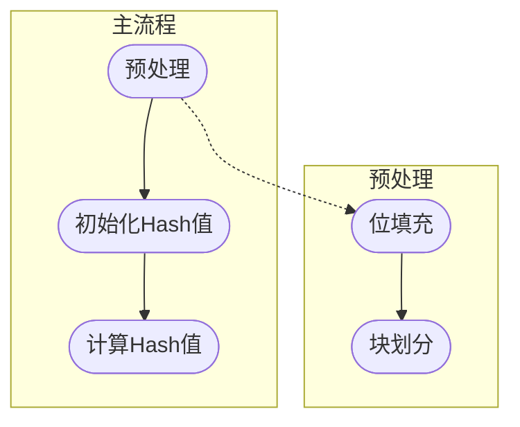

# [SHA安全散列算法](#toc)

[TOC]
<span id='toc'></span>

## [简要说明](#toc)

SHS(Secure Hash Standard, FIPS 180-4)定义了SHA-1, SHA-224, SHA-256, SHA-384, SHA-512, SHA-512/224和SHA-512/256这几种SHA算法, 每种SHA算法所能处理消息长度/块大小/单词长度/消息摘要长度如下表:  

||消息长度(bits)|块大小(bits)|单词长度(bits)|消息摘要长度(bits)|
|:----:|:-:|:-:|:-:|:-:|
|SHA-1|$\lt 2^{64}$|512|32|160|
|SHA-224|$\lt 2^{64}$|512|32|224|
|SHA1-256|$\lt 2^{64}$|512|32|256|
|SHA1-384|$\lt 2^{128}$|1024|64|384|
|SHA1-512|$\lt 2^{128}$|1024|64|512|
|SHA1-512/224|$\lt 2^{128}$|1024|64|224|
|SHA1-512/256|$\lt 2^{128}$|1024|64|256|

## [算法流程](#toc)



## [预处理](#toc)

### [位填充](#toc)

#### [位填充: SHA-1 SHA-224 SHA-256](#toc)

填充的规则: 经过位填充后的消息长度是512的整数倍. 记位长度为$l$的消息为$Msg$ 填充规则如下:  

- 在$Msg$后填充一位1, 然后再填充若干位0, 以使得填充后的消息长度是448的整数倍, 记为$Msg_p$;  
- 将位长度$l$放入后续的64位中, 经过此步后, 填充的消息的位长度是512的整数倍;  
  - 注意: $l$的按照从高字节到低字节的顺序依次填充到$Msg_p$之后;

记经过位填充后的消息为$M$.

#### [位填充: SHA-384 SHA-512 SHA-512/224 SHA-512/256](#toc)

填充的规则: 经过位填充后的消息长度是1024的整数倍. 记位长度为$l$的消息为$Msg$ 填充规则如下:  

- 在$Msg$后填充一位1, 然后再填充若干位0, 以使得填充后的消息长度是896的整数倍, 记为$Msg_p$;  
- 将位长度$l$放入后续的128位中, 经过此步后, 填充的消息的位长度是1024的整数倍;  
  - 注意: $l$的按照从高字节到低字节的顺序依次填充到$Msg_p$之后;

记经过位填充后的消息为$M$.

### [块划分](#toc)

#### [块划分: SHA-1 SHA-224 SHA-256](#toc)

将消息$M$按512位长度, 划分为$N$个消息块, 依次记为$M^{(1)}, M^{(2)},\cdots,M^{(N)}$. 然后将每个消息块再划分为32位长的单词, 依次记为$M^{(i)}_{0}, M^{(i)}_{1},\cdots,M^{(i)}_{15}$. 其中, $M^{i}_{j}$表示第$i$个块中的第$j$个单词.

#### [块划分: SHA-384 SHA-512 SHA-512/224 SHA-512/256](#toc)

将消息$M$按1024位长度, 划分为$N$个消息块, 依次记为$M^{(1)}, M^{(2)},\cdots,M^{(N)}$. 然后将每个消息块再划分为64位长的单词, 依次记为$M^{(i)}_{0}, M^{(i)}_{1},\cdots,M^{(i)}_{15}$. 其中, $M^{i}_{j}$表示第$i$个块中的第$j$个单词.

## [初始化Hash值](#toc)

各个SHA算法的初始化Hash值如下, 其中$H_{j}^{i}$表示第$i$轮Hash值的第$j$个单词.  

- SHA-1;  

$$
\begin{aligned}
& H_{0}^{0} = 0x67452301, H_{1}^{0} = 0xEFCDAB89, H_{2}^{0} = 0x98BADCFE \\
& H_{3}^{0} = 0x10325476, H_{4}^{0} = 0xC3D2E1F0
\end{aligned}
$$

- SHA-224;

$$
\begin{aligned}
& H_{0}^{0} = 0xC1059ED8, H_{1}^{0} = 0x367CD507, H_{2}^{0} = 0x3070DD17 \\
& H_{3}^{0} = 0xF70E5939, H_{4}^{0} = 0xFFC00B31, H_{5}^{0} = 0x68581511 \\
& H_{6}^{0} = 0x64F98FA7, H_{7}^{0} = 0xBEFA4FA4
\end{aligned}
$$

- SHA-256;

$$
\begin{aligned}
& H_{0}^{0} = 0x6A09E667, H_{1}^{0} = 0xBB67AE85, H_{2}^{0} = 0x3C6EF372 \\
& H_{3}^{0} = 0xA54FF53A, H_{4}^{0} = 0x510E527F, H_{5}^{0} = 0x9B05688C \\
& H_{6}^{0} = 0x1F83D9AB, H_{7}^{0} = 0x5BE0CD19
\end{aligned}
$$

- SHA-384

$$
\begin{aligned}
& H_{0}^{0} = 0xcbbb9d5dc1059ed8, H_{1}^{0} = 0x629a292a367cd507, H_{2}^{0} = 0x9159015a3070dd17 \\
& H_{3}^{0} = 0x152fecd8f70e5939, H_{4}^{0} = 0x67332667ffc00b31, H_{5}^{0} = 0x8eb44a8768581511 \\
& H_{6}^{0} = 0xdb0c2e0d64f98fa7, H_{7}^{0} = 0x47b5481dbefa4fa4
\end{aligned}
$$

- SHA-512

$$
\begin{aligned}
& H_{0}^{0} = 0x6a09e667f3bcc908, H_{1}^{0} = 0xbb67ae8584caa73b, H_{2}^{0} = 0x3c6ef372fe94f82b \\
& H_{3}^{0} = 0xa54ff53a5f1d36f1, H_{4}^{0} = 0x510e527fade682d1, H_{5}^{0} = 0x9b05688c2b3e6c1f \\
& H_{6}^{0} = 0x1f83d9abfb41bd6b, H_{7}^{0} = 0x5be0cd19137e2179
\end{aligned}
$$

- SHA-512/224

$$
\begin{aligned}
& H_{0}^{0} = 0x8c3d37c819544da2, H_{1}^{0} = 0x73e1996689dcd4d6, H_{2}^{0} = 0x1dfab7ae32ff9c82 \\
& H_{3}^{0} = 0x679dd514582f9fcf, H_{4}^{0} = 0x0f6d2b697bd44da8, H_{5}^{0} = 0x77e36f7304c48942 \\
& H_{6}^{0} = 0x3f9d85a86a1d36c8, H_{7}^{0} = 0x1112e6ad91d692a1
\end{aligned}
$$

- SHA-512/256

$$
\begin{aligned}
& H_{0}^{0} = 0x22312194fc2bf72c, H_{1}^{0} = 0x9f555fa3c84c64c2, H_{2}^{0} = 0x2393b86b6f53b151 \\
& H_{3}^{0} = 0x963877195940eabd, H_{4}^{0} = 0x96283ee2a88effe3, H_{5}^{0} = 0xbe5e1e2553863992 \\
& H_{6}^{0} = 0x2b0199fc2c85b8aa, H_{7}^{0} = 0x0eb72ddc81c52ca2
\end{aligned}
$$

### [SHA-512/t的初始Hash值计算](#toc)

SHA-512/t是利用SHA-512算法计算出512位的摘要值, 然后截断输出t位. 其中, $t < 512, t \ne 384$. 其初始Hash值计算如下:

- 将SHA-512的初始Hash值的每个单词与$a5a5a5a5a5a5a5a5$异或, 然后将该异或后的结果作为SHA-512的初始Hash值;  
- 再利用SHA-512算法, 对字符串`SHA-512/t`做SHA-512 Hash计算, 然后计算的结果作为SHA-512/t算法的初始Hash值. 其中, 字符串`SHA-512/t`中的t替换具体的数字, 例如t=256, 那么字符串为`SHA-512/256`.  

注: 类似的, SHA-224是SHA-256的特化;

## [计算Hash值](#toc)

### [SHA-1 Hash值计算](#toc)

算法伪代码如下:

$$
\begin{aligned}
& MASK = 0x0000000f \\
& \quad \\
& for \quad i=0 \dots N \\
& \qquad for \quad j=0...16 \\
& \qquad \qquad W_{j}=M_{j}^{i} \\
& \qquad end \\
& \quad \\
& \qquad a = H_{0}^{i}, b=H_{1}^{i}, c=H_{2}^{i}, d=H_{3}^{i}, e=H_{4}^{i} \\
& \quad \\
& \qquad for \quad j=0...80 \\
& \qquad \qquad s = j \And MASK \\
& \qquad \qquad if \quad j \ge 16 \\
& \qquad \qquad \qquad W_{s} = (W_{(s+13)\And MASK}\oplus W_{(s+8)\And MASK} \oplus W_{(s+2)\And MASK} \oplus W_{s}) \lll 1 \\
& \qquad \qquad end \\
& \qquad \qquad t = (a \lll 5) + f_{t}(b,c,d) + e + K_{t} + W_{s} \\
& \qquad \qquad a,b,c,d,e=t,a,(b\lll 30), c,d \\
& \qquad end \\
& \quad \\
& \qquad H_{0}^{i+1},H_{1}^{i+1},H_{2}^{i+1},H_{3}^{i+1},H_{4}^{i+1}=a+H_{0}^{i},b+H_{1}^{i},c+H_{2}^{i},d+H_{3}^{i},e+H_{4}^{i}\\
& end \\
& \quad \\
& H=[H_{0}^{N},H_{1}^{N},H_{2}^{N},H_{3}^{N},H_{4}^{N}]
\end{aligned}
$$

### [SHA-256 Hash值计算](#toc)

算法伪代码如下:

$$
\begin{aligned}
& for \quad i=0 \dots N \\
& \qquad for \quad j=0...64 \\
& \qquad \qquad if \quad j \le 16 \\
& \qquad \qquad \qquad W_{j}=M_{j}^{i} \\
& \qquad \qquad else \\
& \qquad \qquad \qquad W_{j} = \sigma_{1}^{256}(W_{j-2}) + W_{j-7} + \sigma_{0}^{256}(W_{j-15}) + W_{j-16}\\
& \qquad \qquad end \\
& \qquad end \\
& \quad \\
& \qquad a = H_{0}^{i}, b=H_{1}^{i}, c=H_{2}^{i}, d=H_{3}^{i}, e=H_{4}^{i}, f=H_{5}^{i}, g=H_{6}^{i}, h=H_{7}^{i} \\
& \quad \\
& \qquad for \quad j=0...64 \\
& \qquad \qquad t_{1} = h+\sum_{1}^{256}(e)+Ch(e,f,g)+K_{j}+W_{j} \\
& \qquad \qquad t_{2} = \sum_{0}^{256}(a)+Maj(a,b,c) \\
& \qquad \qquad a,b,c,d,e,f,g,h=t_{1}+t_{2},a,b,c,d+t_{1},e,f,g \\
& \qquad end \\
& \quad \\
& \qquad H_{0}^{i+1},H_{1}^{i+1},H_{2}^{i+1},H_{3}^{i+1},H_{4}^{i+1},H_{5}^{i+1},H_{6}^{i+1},H_{7}^{i+1}=a+H_{0}^{i},b+H_{1}^{i},c+H_{2}^{i},d+H_{3}^{i},e+H_{4}^{i},f+H_{5}^{i},g+H_{6}^{i},h+H_{7}^{i}\\
& end \\
& \quad \\
& H=[H_{0}^{N},H_{1}^{N},H_{2}^{N},H_{3}^{N},H_{4}^{N},H_{5}^{N},H_{6}^{N},H_{7}^{N}]
\end{aligned}
$$

### [SHA-224 Hash值计算](#toc)

SHA-224是SHA-256的特化, 除了其初始Hash值不同外, 和SHA-256的计算过程一致, 最后结果截断为224位$H=[H_{0}^{N},H_{1}^{N},H_{2}^{N},H_{3}^{N},H_{4}^{N},H_{5}^{N},H_{6}^{N}]$.

### [SHA-512 Hash值计算](#toc)

算法伪代码如下:

$$
\begin{aligned}
& for \quad i=0 \dots N \\
& \qquad for \quad j=0...80 \\
& \qquad \qquad if \quad j \le 16 \\
& \qquad \qquad \qquad W_{j}=M_{j}^{i} \\
& \qquad \qquad else \\
& \qquad \qquad \qquad W_{j} = \sigma_{1}^{512}(W_{j-2}) + W_{j-7} + \sigma_{0}^{512}(W_{j-15}) + W_{j-16}\\
& \qquad \qquad end \\
& \qquad end \\
& \quad \\
& \qquad a = H_{0}^{i}, b=H_{1}^{i}, c=H_{2}^{i}, d=H_{3}^{i}, e=H_{4}^{i}, f=H_{5}^{i}, g=H_{6}^{i}, h=H_{7}^{i} \\
& \quad \\
& \qquad for \quad j=0...80 \\
& \qquad \qquad t_{1} = h+\sum_{1}^{512}(e)+Ch(e,f,g)+K_{j}+W_{j} \\
& \qquad \qquad t_{2} = \sum_{0}^{512}(a)+Maj(a,b,c) \\
& \qquad \qquad a,b,c,d,e,f,g,h=t_{1}+t_{2},a,b,c,d+t_{1},e,f,g \\
& \qquad end \\
& \quad \\
& \qquad H_{0}^{i+1},H_{1}^{i+1},H_{2}^{i+1},H_{3}^{i+1},H_{4}^{i+1},H_{5}^{i+1},H_{6}^{i+1},H_{7}^{i+1}=a+H_{0}^{i},b+H_{1}^{i},c+H_{2}^{i},d+H_{3}^{i},e+H_{4}^{i},f+H_{5}^{i},g+H_{6}^{i},h+H_{7}^{i}\\
& end \\
& \quad \\
& H=[H_{0}^{N},H_{1}^{N},H_{2}^{N},H_{3}^{N},H_{4}^{N},H_{5}^{N},H_{6}^{N},H_{7}^{N}]
\end{aligned}
$$

### [SHA-384 Hash值计算](#toc)

SHA-384是SHA-512的特化, 除了其初始Hash值不同外, 和SHA-512的计算过程一致, 最后结果截断为384位$H=[H_{0}^{N},H_{1}^{N},H_{2}^{N},H_{3}^{N},H_{4}^{N},H_{5}^{N}]$.

### [SHA-512/224 Hash值计算](#toc)

SHA-512/224是SHA-512的特化, 除了其初始Hash值不同外, 和SHA-512的计算过程一致, 最后结果截断为384位$H=[H_{0}^{N},H_{1}^{N},H_{2}^{N},H_{3}^{N}(0\dots32)]$.

### [SHA-512/256 Hash值计算](#toc)

SHA-512/256是SHA-512的特化, 除了其初始Hash值不同外, 和SHA-512的计算过程一致, 最后结果截断为384位$H=[H_{0}^{N},H_{1}^{N},H_{2}^{N},H_{3}^{N}]$.

## [函数常量说明](#toc)

- $x \oplus y$: x异或y;
- $x \lll n$: x循环左移n位;
- $x \ggg n$: x循环右移n位;
- $x \gg n$: x右移n位, 高n位填充为0;
- $x + y$: $(x+y)\%2^{l}$, $l$表示单词长度;  
- $Ch(x,y,z), Maj(x,y,z)$式中的异或操作可以换或操作;

### [SHA-1](toc)

$$
f_{t}(x,y,z) =
\begin{cases}
Ch(x,y,z) = (x \& y) \oplus ((\sim x) \& z), \quad 0 \le t \le 19 \\
Parity(x,y,z) = x \oplus y \oplus z, \quad 20 \le t \le 39 \\
Maj(x,y,z) = (x \& y)\oplus (x \& z) \oplus (y\&z), \quad 40 \le t \le 59 \\
Parity(x,y,z) = x \oplus y \oplus z, \quad 60 \le t \le 79
\end{cases}
$$

$$
K_{t} =
\begin{aligned}
& 0x5A827999, \quad 0 \le t \le 19 \\
& 0x6ED9EBA1, \quad 20 \le t \le 39\\
& 0x8F1BBCDC, \quad 40 \le t \le 59\\
& 0xCA62C1D6, \quad 60 \le t \le 79
\end{aligned}
$$

### [SHA-224 SHA-256](toc)

$$
\begin{aligned}
Ch(x,y,z) &= (x \& y) \oplus ((\sim x) \& z) \\
Maj(x,y,z) &= (x \& y)\oplus (x \& z) \oplus (y\&z) \\
\sum_{0}^{\{256\}}(x) &= (x\ggg 2)\oplus(x\ggg 13)\oplus(x\ggg 22) \\
\sum_{1}^{\{256\}}(x) &= (x\ggg 6)\oplus(x\ggg 11)\oplus(x\ggg 25) \\
\sigma_{0}^{\{256\}}(x) &= (x\ggg 7)\oplus(x\ggg 18)\oplus(x\gg 3) \\
\sigma_{1}^{\{256\}}(x) &= (x\ggg 17)\oplus(x\ggg 19)\oplus(x\gg 10)
\end{aligned}
$$

常量为自然数前64个质数的立方根的各自小数的前32位:

```rust
const K[u32;64] = [
0x428a2f98,0x71374491,0xb5c0fbcf,0xe9b5dba5,0x3956c25b,0x59f111f1,0x923f82a4,0xab1c5ed5,
0xd807aa98,0x12835b01,0x243185be,0x550c7dc3,0x72be5d74,0x80deb1fe,0x9bdc06a7,0xc19bf174,
0xe49b69c1,0xefbe4786,0x0fc19dc6,0x240ca1cc,0x2de92c6f,0x4a7484aa,0x5cb0a9dc,0x76f988da,
0x983e5152,0xa831c66d,0xb00327c8,0xbf597fc7,0xc6e00bf3,0xd5a79147,0x06ca6351,0x14292967,
0x27b70a85,0x2e1b2138,0x4d2c6dfc,0x53380d13,0x650a7354,0x766a0abb,0x81c2c92e,0x92722c85,
0xa2bfe8a1,0xa81a664b,0xc24b8b70,0xc76c51a3,0xd192e819,0xd6990624,0xf40e3585,0x106aa070,
0x19a4c116,0x1e376c08,0x2748774c,0x34b0bcb5,0x391c0cb3,0x4ed8aa4a,0x5b9cca4f,0x682e6ff3,
0x748f82ee,0x78a5636f,0x84c87814,0x8cc70208,0x90befffa,0xa4506ceb,0xbef9a3f7,0xc67178f2,
];
```

### [SHA-384 SHA-512 SHA-512/224 SHA-512/256](#toc)

$$
\begin{aligned}
Ch(x,y,z) &= (x \& y) \oplus ((\sim x) \& z) \\
Maj(x,y,z) &= (x \& y)\oplus (x \& z) \oplus (y\&z) \\
\sum_{0}^{\{256\}}(x) &= (x\ggg 28)\oplus(x\ggg 34)\oplus(x\ggg 39) \\
\sum_{1}^{\{256\}}(x) &= (x\ggg 14)\oplus(x\ggg 18)\oplus(x\ggg 41) \\
\sigma_{0}^{\{256\}}(x) &= (x\ggg 1)\oplus(x\ggg 8)\oplus(x\gg 7) \\
\sigma_{1}^{\{256\}}(x) &= (x\ggg 19)\oplus(x\ggg 61)\oplus(x\gg 6)
\end{aligned}
$$

常量为自然数前80个质数的立方根的各自小数的前64位:

```rust
const K[u64;80] = [
0x428a2f98d728ae22,0x7137449123ef65cd,0xb5c0fbcfec4d3b2f,0xe9b5dba58189dbbc,0x3956c25bf348b538,0x59f111f1b605d019,0x923f82a4af194f9b,0xab1c5ed5da6d8118,
0xd807aa98a3030242,0x12835b0145706fbe,0x243185be4ee4b28c,0x550c7dc3d5ffb4e2,0x72be5d74f27b896f,0x80deb1fe3b1696b1,0x9bdc06a725c71235,0xc19bf174cf692694,
0xe49b69c19ef14ad2,0xefbe4786384f25e3,0x0fc19dc68b8cd5b5,0x240ca1cc77ac9c65,0x2de92c6f592b0275,0x4a7484aa6ea6e483,0x5cb0a9dcbd41fbd4,0x76f988da831153b5,
0x983e5152ee66dfab,0xa831c66d2db43210,0xb00327c898fb213f,0xbf597fc7beef0ee4,0xc6e00bf33da88fc2,0xd5a79147930aa725,0x06ca6351e003826f,0x142929670a0e6e70,
0x27b70a8546d22ffc,0x2e1b21385c26c926,0x4d2c6dfc5ac42aed,0x53380d139d95b3df,0x650a73548baf63de,0x766a0abb3c77b2a8,0x81c2c92e47edaee6,0x92722c851482353b,
0xa2bfe8a14cf10364,0xa81a664bbc423001,0xc24b8b70d0f89791,0xc76c51a30654be30,0xd192e819d6ef5218,0xd69906245565a910,0xf40e35855771202a,0x106aa07032bbd1b8,
0x19a4c116b8d2d0c8,0x1e376c085141ab53,0x2748774cdf8eeb99,0x34b0bcb5e19b48a8,0x391c0cb3c5c95a63,0x4ed8aa4ae3418acb,0x5b9cca4f7763e373,0x682e6ff3d6b2b8a3,
0x748f82ee5defb2fc,0x78a5636f43172f60,0x84c87814a1f0ab72,0x8cc702081a6439ec,0x90befffa23631e28,0xa4506cebde82bde9,0xbef9a3f7b2c67915,0xc67178f2e372532b,
0xca273eceea26619c,0xd186b8c721c0c207,0xeada7dd6cde0eb1e,0xf57d4f7fee6ed178,0x06f067aa72176fba,0x0a637dc5a2c898a6,0x113f9804bef90dae,0x1b710b35131c471b,
0x28db77f523047d84,0x32caab7b40c72493,0x3c9ebe0a15c9bebc,0x431d67c49c100d4c,0x4cc5d4becb3e42b6,0x597f299cfc657e2a,0x5fcb6fab3ad6faec,0x6c44198c4a475817,
];
```

## [参考资料](#toc)

- [FIPS 180-4](https://csrc.nist.gov/publications/detail/fips/180/4/final);  
