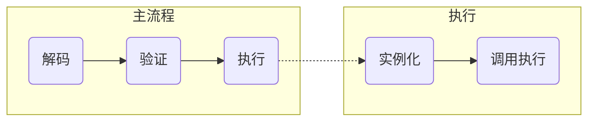

# WebAssembly

<span id='toc'></span>
[TOC]



## [解码](#toc)

### [类型种类](#toc)

- 基本数值类型: `i32 | i64 | f32 | f64`;
- 返回值: 执行指令或调用函数的返回值, 基本数值类型序列;
- 函数: 将一组基本数值类型序列映射到另一组基本数值类型序列;
- 内存: 一块线性内存;
- 表: 一些相同类型的元素组成的序列, 当前表元素允许的类型仅有函数引用一种;
- 全局变量: 可修改(var)和不可修改的(const)的基本数据类型;
- 外部类型: 可从其它模块引用/导入到本模块的类型, 包括函数/表/内存/全局变量;

### [基本数值类型](#toc)

- 字节;
- 整数: `u32 | u64 | s32 | s64 | i8 | i16 | i32 | i64`, `Boolean`和`内存地址`使用32位的整数表示;
- 浮点数: `f32 | f64`, **IEEE-754-2019**标准;

### [指令](#toc)

- 数值操作指令:
  - 整数一元操作指令: `clz | ctz | popcnt`;
  - 整数二元操作指令: `add | sub | mul | div_sx | rem_sx | and | or | xor | shl | shr_sx | rotl | rotr`;
  - 浮点数一元操作指令: `abs | neg | sqrt | ceil | floor | trunc | nearest`;
  - 浮点数二元操作指令: `add | sub | mul | div | min | max | copysign`;
  - 整数测试操作指令: `eqz`;
  - 整数关系操作指令: `eq | ne | lt_sx | gt_sx | le_sx | ge_sx`;
  - 浮点数关系操作指令: `eq | ne | lt | gt | le | ge`;
- 参数操作指令: `drop | select`;
- 变量操作指令: `local.get | local.set | local.tee | global.set | global.get`;
- 内存操作指令: `memory.grow | memory.size | load | store`, 对于多字节的内存的读写是按照小端序解释的;
- 控制指令: `nop | unreachable | block | loop | if/else | br | br_if | br_table | return | call | call_indirect`;
- 表达式: `end`;

*注: _sx后缀表示可能会存在数值类型转换*;

### [模块](#toc)

模块按如下形式组织:

```txt
module ::= {
  types vec(functype),
  funcs vec(func),
  tables vec(table),
  mems vec(mem),
  globals vec(global),
  elem vec(elem),
  data vec(data),
  start start?,
  imports vec(import),
  exports vec(export),
}
```

- `types`: 模块中使用的所有函数类型必须定义在types类型序列中. 该序列中, 从外部导入的函数类型签名放在本模块的签名的签名;
- `funcs`: 模块中使用的所有函数必须定义在funcs序列中, 有`func ::= type typeidx, locals vec{valtype}, body expr`:
  - `type`: 函数类型(签名), 可从types序列中找到;
  - `locals`: 函数参数和函数使用的局部变量, 参数和局部变量均可修改. 其中, 函数参数在`locals`序列的头部;
  - `body`: 函数体的指令序列, 函数最后一个执行的指令的返回类型必须和该函数的返回类型匹配;
- `tables`: 模块定义或从其他模块导入的表类型序列;
- `mems`: 模块定义或从其他模块导入的内存类型序列;
- `globals`: 模块定义或从其他模块导入的全局类型序列;
- `elem`: `tables`序列中某个表的元素的初始化组成的序列, `elem ::= {table tableidx, offset expr, init vec(funcidx)}`;
- `data`: `mems`序列中某个内存的数据初始化组成的序列, `data ::= {data memidx, offset expr, init vec(byte)}`;
- `start`: 模块的初始化函数在`funcs`序列中的索引. 模块初始化函数在模块实例化时调用, 且在`tables`和`mems`初始化后调用;
- `import`: `import ::= {module name, name name, desc importdesc}`从其他模块导入到本模块中的函数/表/内存全局变量, `desc`描述了导入的函数在`funcs`中的索引/表的类型/内存类型/全局变量类型;
- `export`: `export ::= {name name, desc exportdesc}`从本模块导出函数/表/内存/全局变量, `desc`描述了导出的函数/表/内存/全局变量在`funcs`/`tables`/`mems`/`globals`序列中的的索引;

## [验证](#toc)

### [语境](#toc)

记有语境`C`如下:

```txt
C ::= {
  types   functype*,
  funcs   functype*,
  tables  tabletype*,
  mems    memtype*,
  globals globaltype*,
  locals  valtype*,
  labels  resulttype*,
  return  resulttype?,
}
```

- types: 当前模块定义的类型组成的序列;
- funcs: 当前模块声明的函数组成的序列;
- tables: 当前模块声明的表组成的序列;
- mems: 当前模块声明的内存组成的序列;
- globals: 当前模块声明的全局变量组成的序列;
- locals: 当前函数的参数及其中声明的局部变量组成的序列;
- labels: 当前位置可访问的栈标签, 用返回类型表示;
- return: 当前函数的返回类型;

记如下符号为: 若条件$premise_1, premise_2, \dots, premise_n$成立, 则在语境`C`中$A$满足从$T1$映射$T2$的约束;

$$
\frac{premise_1, premise_2, \dots premise_n}{C \vdash A: T1 \rightarrow T2}
$$

### [类型验证](#toc)

#### [范围验证](#toc)

$$
\begin{aligned}
& \frac{n \le k \quad (m \le k)^? \quad (n \le m)^?}{\vdash limits: k}
\end{aligned}
$$

#### [块类型验证](#toc)

$$
\begin{aligned}
& \frac{C.types[typeidx] = functype}{C \vdash typeidx: functype}
\end{aligned}
$$

#### [函数类型验证](#toc)

$$
\begin{aligned}
& \frac{}{\vdash [t_1^*] \rightarrow [t_2^*] \ ok}
\end{aligned}
$$

#### [表类型验证](#toc)

$$
\begin{aligned}
& \frac{\vdash limits: k}{\vdash limits \ elemtype \ ok}
\end{aligned}
$$

#### [内存类型验证](#toc)

$$
\begin{aligned}
& \frac{\vdash limits: 2^{16}}{\vdash limits \ ok}
\end{aligned}
$$

#### [全局变量类型验证](#toc)

$$
\begin{aligned}
& \frac{}{\vdash mut \ valtype \ ok}
\end{aligned}
$$

#### [外部类型验证](#toc)

$$
\begin{aligned}
& \frac{\vdash functype \ ok}{\vdash func \ functype \quad ok} \\
& \\
& \frac{\vdash tabletype \ ok}{\vdash table \ tabletype \ ok} \\
& \\
& \frac{\vdash memtype \ ok}{\vdash mem \ memtype \ ok} \\
& \\
& \frac{\vdash globaltype \ ok}{\vdash global \ globaltype \ ok} \\
\end{aligned}
$$

#### [指令验证](#toc)

##### [数值指令验证](#toc)

$$
\begin{aligned}
& \frac{}{C \vdash t.const \ c: [] \rightarrow [t]} \\
& \frac{}{C \vdash t.unop: [t] \rightarrow [t]} \\
& \frac{}{C \vdash t.binop: [t t] \rightarrow [t]} \\
& \frac{}{C \vdash t.relop: [t t] \rightarrow [i32]} \\
& \frac{}{C \vdash t.testop: [t] \rightarrow [i32]} \\
& \frac{}{C \vdash t.cvtop\_t_1\_sx^?: [t_1] \rightarrow [t_2]} \\
\end{aligned}
$$

##### [参数指令验证](#toc)

$$
\begin{aligned}
& \frac{}{C \vdash drop: [t] \rightarrow []} \\
& \frac{}{C \vdash select: [t t i32] \rightarrow [t]}
\end{aligned}
$$

##### [变量指令验证](#toc)

$$
\begin{aligned}
& \frac{C.locals[x] = t}{C \vdash local.get\ x: [] -> [t]} \\
& \frac{C.locals[x] = t}{C \vdash local.set\ x: [t] -> []} \\
& \frac{C.locals[x] = t}{C \vdash local.tee\ x: [t] -> [t]} \\
& \frac{C.globals[x] = mut\ t}{C \vdash globals.get\ x: [] -> [t]} \\
& \frac{C.globals[x] = var\ t}{C \vdash globals.set\ x: [t] -> []} \\
\end{aligned}
$$

##### [内存指令验证](#toc)

##### [控制指令验证](#toc)

##### [模块验证](#toc)

## [执行](#toc)

### [运行时结构](#toc)

- 数值常量: `val ::= i32.const | i64.const | f32.const | f64.const`;
- 计算结果: `result ::= val* | trap`;
- store: `store ::= {funcs funcinst*, tables tableinst*, mems meminst*, globals globalinst*}`;
- 地址: 地址是一个i32的整数(u32);
- 模块实例: `moduleinst ::= {types functype*, funcaddrs funcaddr*, tableaddrs tableaddr*, memaddrs memaddr*, globaladdrs globaladdr*, exports exportinst*}`;
- 函数实例: `funcinst ::= {type functype, module moduleinst, code func} | {type functype, hostcode hostfunc}`;
- 表实例: `tableinst ::= {elem vec(funcaddr), max u32?}`;
- 内存实例: `meminst ::= {data vec(byte), max u32?}`;
- 全局变量实例: `globalinst ::= {value val, mut mut}`;
- 导出实例: `exportinst ::= {name name, value externval}`, `externval ::= func funcaddr | table tableaddr | mem memaddr | global globaladdr`;
- 栈: 栈元素有如下三种:
  - 指令的操作数;
  - 控制分支结构: `label ::= label_n{instr*}`;
  - 函数调用帧: `activation ::= frame_n{local val*, module moduleinst}`;

### [实例化](#toc)

### [调用执行](#toc)

## [参考资料](#toc)

- WebAssembly Specification Release 1.1;
