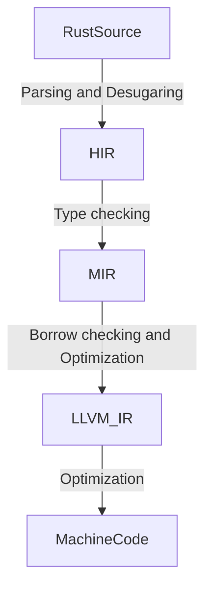

# Rust源码组织结构

</sapn>
[TOC]

## [liballoc](#toc)

内存分配库, 标准库中涉及到堆内存分配相关的代码在此;

- alloc: 全局内存分配器`Global`(实现了`AllocRef`trait), 及内存分配相关的函数`alloc/realloc/dealloc/alloc_zeroed`的实现(他们是对libcore库中的内存分配函数的封装);
- boxed: `Box`(指向堆内存的智能指针, 类似C++中的`unique_ptr`)的实现;
- borrow: `ToOwned` trait实现, 实现`ToOwned`的对象可以从实现了`Borrow`的对象中拷贝内容(`Clone`trait仅负责`T`和`&T`类型的对象的拷贝). `Cow`写时复制(clone-on-write)智能指针;
- fmt: `format`格式化函数的实现;
- macros: `vec!`宏的实现;
- raw_vec: `RawVec`的实现(数组相关数据结构的底层实现, 如`Vec`);
- rc: `Rc`基于引用计数的单线程安全的智能指针实现, 类似于C++中的`shared_ptr`. `Weak`非所有权引用的智能指针实现 类似C++中的`weak_ptr`. 两者底层是`RcBox`;
- slice: `[T]`切片的实现;
- str: `str`字符串切片你的实现;
- String: `String`UTF-8字符串的实现(String底层是`Vec`);
- sync: `Arc`基于引用计数的线程间安全的智能指针实现, 类似于C++中的`atomic<shared_ptr>`. `Weak`非所有权引用的智能指针实现. 两者底层是`ArcInner`;
- task: `Wake`trait实现;
- vec: `Vec`数组的实现(底层是`RawVec`);
- collections: 集合容器的实现;
  - btree: B树数据结构的实现;
    - map: `BTreeMap`基于B树的键值map实现;
    - node: B树根节点`Root`, 树叶子`LeafNode`等相关的实现;
    - search: 根据指定键值搜索的相关函数;
    - set: `BTreeSet`set实现(底层是`BTreeMap`);
  - binary_heap: `BinaryHeap`二叉堆的实现(底层是`Vec`);
  - linked_list: `LinkedList`双向链表实现;
  - vec_deque: `VecDeque`双向队列实现(底层是`RawVec`);

## [libcore](#toc)

Rust核心库, Rust语言特性相关的实现在此中;

- any: `Any`trait实现;
- ascii: `EscapeDefault/escape_default`ASCII字符集相关的特化操作;
- bool: `bool`类型的实现(非基础语言层面的实现, 提供一些额外的辅助功能);
- borrow: `Borrow`trait的实现, 注意和`AsRef`的区别;
- cell: `Cell`内部可变性实现(*interior mutability*), 即不可变的实例可以被覆写(屏蔽编译器对immutable实例不可修改的限制, 该语义的实现是底层的`UnsafeCell`). `RefCell`屏蔽编译器的borrow规则, 只进行动态期的borrow规则检查, 底层是`UnsafeCell`;
- clone: `Clone`trait实现;
- cmp: `PartialEq/PartialOrd/Eq/Ord/Ordering`比较相关的trait;
- default: `Default`trait;
- ffi: `c_void`(做指针使用时等效于c的`void`指针), `VaList`(等效于C语言中的变参参数实现);
- hint: 用于编译器优化相关的实现, `spin_loop/unreachable_unchecked/black_box`;
- internal_macros: 内部使用的宏的定义, 主要是一些操作符的通用宏. 因为Rust中某个trait实现*blanket impl*后, 外部crate就不能在某个类型上实现该trait了(orphan rule and overlap rule). 为了使外crate可以实现核心库中某些trait, 所以通过宏来一条条的对某些类型实现某个trait, 如`Add`;
- intrinsics: 暴露一些基本指令的函数接口;
- marker: 主要用于语法语义的标识trait, 如`Sync/Send/PhantomData`等;
- option: `Option`;
- panic/panicking: panic相关;
- raw: `TraitObject`动态派发对象;
- result: `Result`;
- time: `Duration`;
- tuple: 元组的某些trait实现, 当前这些trait实现上元组参数需小于等于12个. 注: `tuple_impls`的宏实现很值得用于Rust宏学习;
- unit: `(),*`映射到`()`;
- alloc: 内存分配相关;
  - global: `GlobalAlloc`trait, 内存分配器需实现的trait;
  - layout: `Layout`内存布局抽象;
  - `AllocRef/AllocInit/MemoryBlock`: 内存**块**(MemmoryBlock, 多了一个块大小的域, 因此可以标识0大小的内存区域)分配相关接口数据接口;
- array: 数组相关操作, 如`PartialEq/Borrow`等(当前只支持长度小于等于32的数组);
- char: 字符相关;
- convert: `From/TryFrom/Into/TryInto`等转换相关trait(注意: 这些转换trait并不是`as`的重载trait)及对基本类型的这些traits实现, `Infallible`用于标识永远不会出现的Error;
- ptr: 对裸指针的不同用途封装实现(零开销), 及对指针指向内存相关操作的函数封装;
  - unique: `Unique`该指针指向的实例应该只由该`Unique`指针修改, 而不应该通过其它指针修改(`Unique`指针必须是非空的). 注意: `Unique`并没有暴露给外部crate使用;
  - non_null: `NonNull`该指针指向的实例必须是非空的;
  - mut_ptr: `*mut T`指针相关的辅助功能(如对指针偏移计算, 不知为什么偏移计算为什么没有提供诸如`Add<usize>`的重载实现);
  - const_ptr: `*const T`指针相关的辅助功能;
  - `drop_in_place/read/write`等内存操作相关函数封装;
- pin: `Pin`指针;
- slice: 切片操作相关辅助功能;
  - memchr: `memchr/memrchr`在切片中查找子片;
  - rotate: `ptr_rotate`切片旋转操作(为啥要实现这么复杂?);
  - sort: 插入排序, 堆排序, pattern-defeating快排实现;
- unicode: Unicode编解码相关;
- task: 异步任务相关;
  - wake: `RawWaker/RawWakerVTable`异步任务唤醒行为约定, `Context`异步任务的上下文描述;
  - poll: `Pool`异步任务状态;
- sync: 同步相关;
  - atomic: 原子类型和内存顺序相关;
- str: 字符串切片相关(迭代器/有损UTF-8字符串/模式匹配);
- arith: 算术操作符重载trait`Add/Sub/Mul/Div/Rem/BitAnd/BitOr/BitXor/Shl/Shr`, 及诸如`+=`形式操作符的重载trait`AddAssign/...`;
- bit: 一元操作符重载trait`Not/Neg`;
- deref: 解引用重载trait`Deref/DerefMut`;
- drop: 实例对象的析构trait`Drop`;
- function: 函数调用trait`FnMut/Fn/FnOnce`;
- generator: 异步生成器trait`Generator`;
- index: 索引重载trait`Index/IndexMut`;
- range: `Range/RangeFrom/RangeTo/RangeFull/RangeInclusive/RangeToInclusive`;
- try: `?`重载trait`Try`;
- unsize: 动态派发标识`DispatchFromDyn`, `CoerceUnsied`标识可以在指针上完成unsize(编译器不知道指向内容具体大小)的操作;
- num: 一些常用基本数据类型的算术常量定义;
- macros: 暴漏给外部crate使用的诸如`panic!/matches/format_args!`等的宏定义;
- mem: 内存操作相关;
  - manually_drop: `ManuallyDrop`标识手动析构drop的对象(禁止编译器自动drop);
  - maybe_uninit: `MaybeUninit`用于标识可能未初始化对象;
  - `drop/forget/replace/transmute/discriminant`等对象实例内存操作函数, `Discriminant`用于枚举实例类型的判定;
- iter: 迭代器语义实现;
  - 迭代器协议trait`Iterator`, 其它常用的迭代操作的迭代器类型, 如`reverse->Rev/filter->Filter`等;
- hash: 通用hash接口定义;
  - `Hash`表示实现该trait的类型, 可以接收哈希器完成hash运算;
  - `Hasher`trait约定哈希器的接口实现;
  - `BuildHasher`约定哈希器的实例的创建接口;
  - sip: `SipHasher13`[siphash](https://131002.net/siphash/)算法实现(虽然deprecated状态, 但还是当前内部使用的默认的哈希器);
- future: 异步语义实现;
  - `Future`异步计算接口约定trait;
- fmt: 字符串格式化相关;
  - `Binary/Debug/Octal`等约定不同格式化说明符时的输出行为;
  - float: 浮点数的格式化输出实现;
  - num: 整数的格式化输出实现;
  - rt/v1: 格式化输出的细节定义, 如对齐/填充等等;

## [libstd](#toc)

libstd暴露的接口是对一些通用功能的抽象, 但是这些功能的细节实现通常依赖于具体的操作系统. 本节仅描述在libstd中定义实现的(非从`libcore/liballoc`中导入到该libstd的功能)功能接口, 对于具体的细节实现在后续的源码阅读中;

- alloc: `System`由操作系统提供的默认内存分配器, 实现了`AllocRef/GlobalAlloc`trait;
- backtrace: `Backtrace/BacktraceStatus`操作系统线程异常信息捕获(底层`Frame`是对操作系统线程栈帧信息的封装);
- env: `Arg/ArgOs`应用程序启动时传入的命令行参数迭代器, `Var/VarOs`应用程序当前的环境变量迭代器, `SplitPaths`环境变量`PATH`迭代器;
- sync, ffi,io,net,thread, time, error, f32,f64,fs,path,process: 见标准库文档描述;
- rt: rust运行时, 提供全局堆/异常处理等;
- HashMap: `HashMap`底层使用的`hashbrown`库中的HashMap(底层实现是SwissTable算法), 哈希器采用的是`SipHasher13`;
- HashSet: `HashSet`由`HashMap`实现;
- os: 和操作系统相关的特定功能;
  - raw: C语言基本数据类型到Rust基本树类型的映射(`c_float->f32/c_int->i32`等等). 注意`c_void`在libcore::ffi中定义了;
  - linux:
    - fs: `MetadataExt`trait特定平台下的文件元数据扩展信息;
    - raw: Linux平台下不同处理器架构上的一些数据类型到Rust类型的映射(如x86_64架构中Linux系统下`time_t->i64/off_t->u64/stat`等等);
  - redox,vxworks等等系统性类似, 不在赘述.;
- sys: 该模块封装了一些和操作系统具体实现相关的功能, 以对外提供一致的抽象接口;
  - windows: Windows平台下的系统功能;
    - c:
      - windows系统中的一些基本数据类型到Rust数据类型的映射(如`BYTE->u8/ULONG_PTR->usize/LPVOID->*mut c_void`等等), 定义的C基本类型从`crate::os::raw`模块导入. 以及定义了和Windows下等价的符合数据类型(如`in_addr/in6_addr/fd_set/STARTUPINFO`等等). 此外, 还导入了实现标准库所需的线程/网络/io/同步相关的系统函数;
    - time:
      - `InstantTime`: 使用`QueryPerformanceCounter`精确获取时间;
      - `SystemTime`: 使用`GetSystemTimePreciseAsFileTime`精确获取系统时间;
    - alloc:
      - `System`: 标准库的默认内存分配器的使用`HeapAlloc/GetProcessHeap`分配堆内存;
    - args:
      - `args`: 标准库中的`args()/args_os()`的底层都是调用该函数, 其调用系统函数`GetCommandLineW`获取app的命令行输入参数;
    - cmath: 数学函数底层调用;
    - compat: win7和xp的兼容层(`GetProcAddress`);
    - condvar: 标准库CondVar底层实现`SleepConditionVariableSRW/WakeConditionVariable/WakeAllConditionVariable`;
    - env: 和特定系统相关的常量;
    - fs: 主要函数: `FindNextFileW/FindClose/CreateFileW/FlushFileBuffers/SetFileInformationByHandle/GetFileInformationByHandle/GetFileInformationByHandleEx/SetFilePointerEx/CreateDirectoryW/CreateSymbolicLinkW/CreateHardLinkW/SetFileAttributesW/GetFinalPathNameByHandleW/CopyFileExW/DeviceIoControl`, 主要数据结构: `REPARSE_MOUNTPOINT_DATA_BUFFER/WIN32_FIND_DATAW/BY_HANDLE_FILE_INFORMATION/FILE_BASIC_INFO`;
    - handle: `Handle`文件/线程的句柄, 主要调用系统函数`CreateEventW/ReadFile/WriteFile`;
    - mutex: 标准库互斥锁`Mutex`的底层`AcquireSRWLockExclusive/TryAcquireSRWLockExclusive/ReleaseSRWLockExclusive/SRWLOCK`, `ReentrantMutex`递归锁底层`InitializeCriticalSection/EnterCriticalSection/TryEnterCriticalSection/LeaveCriticalSection/DeleteCriticalSection/SRWLOCK`;
    - net: 网络库底层实现`WSAStartup/WSACleanup/WSASocketW/WSARecv/WSASend`;
    - rand: 随机数生成底层实现`RtlGenRandom/BCryptGenRandom`;
    - rwlock: 读写锁`AcquireSRWLockShared/TryAcquireSRWLockShared/AcquireSRWLockExclusive/TryAcquireSRWLockExclusive/ReleaseSRWLockShared/ReleaseSRWLockExclusive`;
    - thread: `CreateThread/WaitForSingleObject/SwitchToThread`;
  - unix: 类unix平台下就很熟悉了, 基本调用的都是POSIX接口, 不再赘述;
- sys_common: 抽象出来的和平台无关的公共接口, 在sys上面封装的一层, 不再赘述;

## [编译过程](#toc)

## [librustc_apfloat](#toc)

任意精度浮点数, IEEE浮点数语义抽象, 实际最多支持128位的总位长;

- ieee: ieee浮点数语义抽象;
  - `Half/Single/Double/Quad/X87DoubleExtended`: 对应16/5, 32/8, 64/11, 128/15, 80/15浮点数(总位长/指数位长);
- ppc: PowerPC平台下的浮点语义实现;
  - `DoubleDouble`: 64/11;

## [librustc_arena](#toc)

Arena内存分配器, `TypedArena`分配只能存储某个类型的内存. `Arena`分配可以存储任意类型的内存, 需要调用者手动管理内存;

## [librustc_serialize](#toc)

- serialize: `Encoder/Decoder/Decodable/Encodable`trait序列化/分序列化协议;
- json: `Json`;

## [librustc_span](#toc)

源文件描述和相关帮助函数, 几个关键数据结构如下:

- `SourceFile`源文件相关信息的描述, 如: 源文件所在的crate, 所使用的外部crate, 源代码, 文件名等等;
- `Span/SpanData`: 表示代码片段的位置;
- `SourceMapFiles/SourceMap`: 源文件集, 文件加载器等等;
- `Symbol`: 内部使用的字符串缓存;
- `kw`: 关键字Symbol;
- `Ident`: 标识符Symbol;

- caching_source_map_view:

## [librustc_data_structures](#toc)

- atomic_ref: `AtomicRef`原子引用;
- base_n: `push_str/encode`将无符号整数转为base_64字符串(这里的BASE_64编码集是该crate自定义的, 非常用的BASE_STD/BASE_URL编码集);
- box_region: `PinnedGenerator`处理自引用数据;
- captures: `Capture`trait用于标识需要捕获的对象的生命周期;
- const_cstr: `const_str!`给字符串加上`\0`C字符串终止符;
- fingerprint: `Fingerprint`哈希指纹;
- flock: `Lock`文件锁;
- frozen: `Frozen`对象不可被修改;
- map_in_place: `MapInPlace`trait, Vec实现了该trait(T->U, 去掉了一些安全性检查);
- profiling: 编译器self-profiling;
- sip128: `SipHasher128`128位SIP哈希器;
- small_c_str: `SmallCStr`短C字符串, 小于37个字符的在栈上, 否则在堆上;
- sorted_map: `SortedMap`Map数据结构, 底层实现`Vec<(K,V)>`, 增删查时间复杂度O(log(n)). `SortedIndexMultiMap`;
- stable_hasher: `StableHasher`包装器, 对外提供一个稳定的哈希器接口(当前是对`SipHasher128`的封装);
- stable_map: `StableMap`对外提供一个稳定的HashMap接口(当前是对`FxHashMap`的封装);
- stable_set: `StableSet`对外提供一个稳定的HashSet接口(当前是对`FxHashSet`的封装);
- stack: 定义了一些栈相关的常量, 栈最小大小100KB, 递归栈大小按指数增长(2^n * 1MB);
- svh: `Svh`哈希值, 用于增量编译比较crate编译的源是否相同;
- sync: `Lrc/Lock/RwLock/MTLock/MtRef`一些锁封装, 配置了parallel_compiler则是使用parking_lot中的锁, 否则使用的是std::cell中的相关容器;
- thin_vec: `ThinVec`底层是`Option<Box<Vec<T>>>`, 0大小的数组不分配堆内存;
- tiny_list: `TinyList`底层是`Option<Element<T>>`, 1个元素的链表不分配堆内存;
- transitive_relation: `TransitiveRelation`传递关系;
- work_queue: `WorkQueue`底层`VecDeque<T>`, 只不过T约束了`Index`, 入队操作会检查索引是否已存在;
- graph: `DirectedGraph/WithNumNodes/WithnumEdges/WithSuccssors/WithPredecessors/WithStartNode`trait约定有向图实现结构, 不同的图实现`VecGraph/Sccs/Graph`;
- obligation_forest: `ObligationForest`职责森林实现, 用于加速[编译速度](https://blog.mozilla.org/nnethercote/);

## [librustc_index](#toc)

`BitSet/BitMatrix/SparseBitSet/SparseBitMatrix/GrowableBitSet/`位数组和位矩阵;

## [librustc_graphviz](#toc)

生成[DOT文件](http://www.graphviz.org/doc/info/lang.html), 用于*Graphviz*可视化显示;

- `Labeller`定义了获取图形节点的属性的协议(如节点id/label/style等等), `GraphWalk`定义了流程图上节点关系, `render`渲染生成`.dot`文件;

## [librustc_driver](#toc)

Rust编译器入口

## [librustc_interface](#toc)

rustc编译器作为一个库, 封装给使用者的同一接口;

- interface:
  - `run_compiler`: 调用编译器进行编译的入口函数;
  - `Compiler`:　编译器会话实例;
  - `Config`: 编译器参数配置实例, 传给`run_compiler`创建`Compiler`会话实例;
- queries:
  - `Queries`: 用于实现编译器*Demand-Driven*的编译;

## [librustc_lexer](#toc)

词法分析器;

- `first_token/strip_shebang`: 词法解析的入口函数
`tokenize`: 生成`Token`的迭代器, 主要数据结构: `Token/TokenKind/LiteralKind`;

## [librustc_macros](#toc)

宏展开器;

## [librustc_ast](#toc)

抽象语法树定义;

- token: 编译器内部使用的`Token`定义;
- tokenstream:
  - `TokenTree`: `Token`树;
  - `TokenStream`: `TokenTree`序列;
- ptr:
  - `P`: 用于AST中的智能指针, 是`Box`的封装. 该智能指针不能获得`*mut T`指针修改其指向的内容, 其`Deref/DerefMut`实现返回的是指针的借用(`&ptr/ &mut ptr`, `Box`是的解引用返回的是指针指向实例的借用);
- visit:
  - `Visitor`: 遍历AST的trait接口定义;
- mut_visit:
  - `MutVisitor`: 遍历AST的trait接口定义;
- parser:
  - `AssocOp/ExprPrecedence`: 定义了二元运算符和表达式的优先级;
- util/comments:
  - `CommentStyle`: 定义了注释风格;
  - `Comment`: 描述了注释的内容/风格/位置等;
- ast:
  - `Label`: 标签;
  - `LifeTime`: 实例对象的生命周期;
  - `PathSegment/Path`: 某个类型/常量/模块的路径, 如`std::option::Option`;
  - `GenericArgs/AngleBracketedArgs/ParenthesizedArgs/GenericArg/GenericParam/WhereClause/Generics`: 泛型相关;
  - `Pat/PatKind/FieldPat`: 模式匹配相关;
  - `StmtKind/Local/Field/Block/ExprKind/Expr`: 语句表达式相关;
  - `Item/ItemKind`: AST元素;

## [librustc_ast_pretty](#toc)

抽象语法树格式化输出

## [librustc_ast_passes](#toc)

对抽象语法树进行一些语法验证;

## [librustc_ast_lowering](#toc)

AST转为HIR;

- `lower_crate/LoweringContext`:

## [librustc_hir](#toc)

HIR

## [librustc_middle/librustc_mir](#toc)

MIR

## [librustc_codegen_ssa](#toc)

提供MIR转为二进制的统一的抽象接口;

## [librustc_codegen_llvm](#toc)

MIR转为二进制, 后端为LLVM;

## [参考资料](#toc)

- [Rust 1.44.1](https://github.com/rust-lang/rust.git);
- [Introducing MIR](https://blog.rust-lang.org/2016/04/19/MIR.html);
